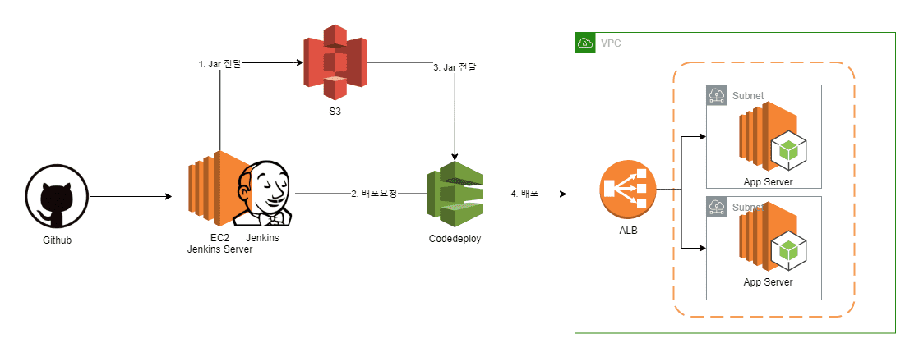

## 백 엔드 App Server 연습 프로젝트

기존에 공부하던 Spring boot 를 젠킨스로 CI/CD를 구축한 프로젝트입니다. AWS를 활용했습니다.

 

자세한 구축 과정은 링크에서 확인할 수 있습니다.

젠킨스 구축 과정 :

1. [AWS EC2에 Jenkins 설치](https://jeonghoon.netlify.app/Jenkins/aws_jenkins/)
2. [AWS Codeploy와 S3, Github를 이용해 Jenkins CI/CD 구축하기(1)](https://jeonghoon.netlify.app/Jenkins/jenkins-codedeploy/)
3. [AWS Codeploy와 S3, Github를 이용해 Jenkins CI/CD 구축하기(2)](https://jeonghoon.netlify.app/Jenkins/jenkins-codedeploy2/)

스프링 부트 구축 과정 : https://jeonghoon.netlify.app/?category=Spring

 

## 기능

### Spring boot

- 기본적인 CRUD
- HTTP 상태코드 제어
- 유효성 체크
- 다국어 처리
- Response 데이터 형식 변환 및 필터링
- Rest API 버전 관리
- Spring Security 인증처리
- Hateoas로 하이퍼미디어 처리
- Swagger 개발자 API 문서 작성
- JPA로 CRUD 및 게시판 일부 구현

 

### Jenkins

- **빌드 자동화**
  - AWS CodeDeploy 연동
  - Github 연동
- **테스트 자동화**
- Email-ext-plugin으로 **이메일로 통합 결과 공유**
- Disk Usage Plugin으로 **디스크 용량**  **모니터링**
- Dependency Graph View Plugin으로 **의존성 그래프 보기**

